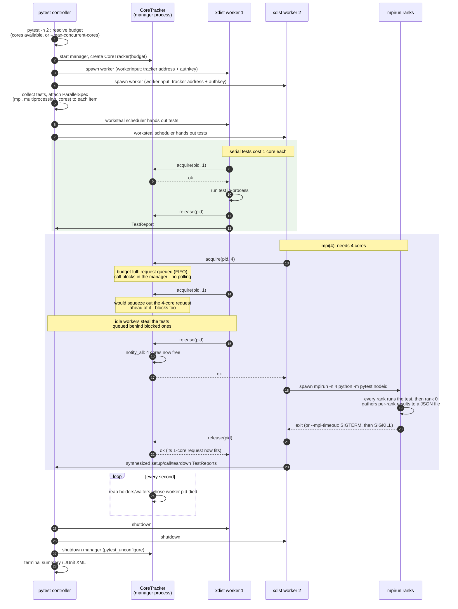

[![PyPI version][1]][2]

testflo
=======

testflo is a python testing framework that uses a pipeline of
iterators to process test specifications, run the tests, and process the
results.

Why write another testing framework?
------------------------------------

testflo was written to support testing of the OpenMDAO framework.
Some OpenMDAO features require execution under MPI while some others don't,
so we wanted a testing framework that could run all of our tests in the same
way and would allow us to build all of our tests using unittest.TestCase
objects that we were already familiar with.  The MPI testing functionality
was originally implemented using the nose testing framework.  It worked, but
was always buggy, and the size and complexity of the nose framework made it
difficult to know exactly what was going on.

Enter testflo, an attempt to build a simpler testing framework that would have
the basic functionality of other test frameworks, with the additional
ability to run MPI unit tests that are very similar to regular unit tests.


Some testflo features
---------------------

*    MPI unit testing
*    *pre_announce* option to print test name before running in order to
     quickly identify hanging MPI tests
*    concurrent testing  (on by default, use '-n 1' to turn it off)
*    test coverage
*    flexible execution - can be given a directory, a file, a module path,
     *file:testcase.method*, *module:testcase.method*, or a file containing
     a list of any of the above. Has options to generate test list files
     containing all failed tests or all tests that execute within a certain
     time limit.
*    end of testing summary


Usage
-----

For a full list of testflo options, execute the following:

`testflo -h`


NOTE: Because testflo runs tests concurrently by default, your tests must be
written with concurrency in mind or they may fail.  For example, if multiple
tests write output to a file with the same name, you have to make sure that those
tests are executed in different directories to prevent that file from being
corrupted.  If your tests are not written to run concurrently, you can always
just run them with `testflo -n 1` and run them in serial instead.

The following is an example of what an MPI unit test looks like.  To tell
testflo that a TestCase is an MPI TestCase, you add a class attribute
called N_PROCS to it and set it to the number of MPI processes to use for the
test.  That's all there is to it. Of course, depending on what sort of MPI code
you're testing, it's up to you to potentially test for different things on
different ranks.


```python

class MyMPI_TestCase(TestCase):

    N_PROCS = 4  # this is how many MPI processes to use for this TestCase.

    def test_foo(self):

        # do your MPI testing here, e.g.,

        if self.comm.rank == 0:
            # some test only valid on rank 0...


```


Here's an example of testflo output for openmdao.core:


```

openmdao$ testflo openmdao.core
............................................................................
............................................................................
............................................................................
..............................

OK

Passed:  258
Failed:  0
Skipped: 0


Ran 258 tests using 8 processes
Wall clock time:   00:00:1.82

```

Running testflo in verbose mode on openmdao.core.test.test_problem is shown
below. The verbose output contains the full test name as well as the elapsed
time and memory usage.


```

openmdao$ testflo openmdao.core.test.test_problem -v
openmdao.core.test.test_problem:TestCheckSetup.test_pbo_messages ... OK (00:00:0.02, 69 MB)
openmdao.core.test.test_problem:TestProblem.test_check_promotes ... OK (00:00:0.01, 69 MB)
openmdao.core.test.test_problem:TestProblem.test_conflicting_connections ... OK (00:00:0.02, 69 MB)
openmdao.core.test.test_problem:TestProblem.test_conflicting_promoted_state_vars ... OK (00:00:0.00, 69 MB)
openmdao.core.test.test_problem:TestProblem.test_conflicting_promotions ... OK (00:00:0.01, 69 MB)
openmdao.core.test.test_problem:TestCheckSetup.test_out_of_order ... OK (00:00:0.02, 69 MB)
openmdao.core.test.test_problem:TestProblem.test_explicit_connection_errors ... OK (00:00:0.02, 69 MB)
openmdao.core.test.test_problem:TestProblem.test_find_subsystem ... OK (00:00:0.00, 69 MB)
openmdao.core.test.test_problem:TestCheckSetup.test_cycle ... OK (00:00:0.06, 69 MB)
openmdao.core.test.test_problem:TestProblem.test_input_input_explicit_conns_no_conn ... OK (00:00:0.01, 69 MB)
openmdao.core.test.test_problem:TestProblem.test_illegal_desvar ... OK (00:00:0.01, 69 MB)
openmdao.core.test.test_problem:TestProblem.test_input_input_explicit_conns_w_conn ... OK (00:00:0.02, 69 MB)
openmdao.core.test.test_problem:TestProblem.test_check_connections ... OK (00:00:0.06, 69 MB)
openmdao.core.test.test_problem:TestProblem.test_mode_auto ... OK (00:00:0.03, 69 MB)
openmdao.core.test.test_problem:TestProblem.test_check_parallel_derivs ... OK (00:00:0.01, 69 MB)
openmdao.core.test.test_problem:TestProblem.test_simplest_run ... OK (00:00:0.01, 69 MB)
openmdao.core.test.test_problem:TestProblem.test_basic_run ... OK (00:00:0.03, 69 MB)
openmdao.core.test.test_problem:TestProblem.test_change_solver_after_setup ... OK (00:00:0.04, 69 MB)
openmdao.core.test.test_problem:TestProblem.test_no_vecs ... OK (00:00:0.08, 69 MB)
openmdao.core.test.test_problem:TestProblem.test_src_idx_gt_src_size ... OK (00:00:0.01, 69 MB)
openmdao.core.test.test_problem:TestProblem.test_src_idx_neg ... OK (00:00:0.01, 69 MB)
openmdao.core.test.test_problem:TestProblem.test_simplest_run_w_promote ... OK (00:00:0.02, 69 MB)
openmdao.core.test.test_problem:TestProblem.test_unconnected_param_access ... OK (00:00:0.01, 69 MB)
openmdao.core.test.test_problem:TestProblem.test_variable_access_before_setup ... OK (00:00:0.00, 69 MB)
openmdao.core.test.test_problem:TestProblem.test_scalar_sizes ... OK (00:00:0.07, 69 MB)
openmdao.core.test.test_problem:TestProblem.test_byobj_run ... OK (00:00:0.01, 69 MB)
openmdao.core.test.test_problem:TestProblem.test_error_change_after_setup ... OK (00:00:0.31, 70 MB)
openmdao.core.test.test_problem:TestProblem.test_unconnected_param_access_with_promotes ... OK (00:00:0.04, 69 MB)
openmdao.core.test.test_problem:TestProblem.test_variable_access ... OK (00:00:0.06, 69 MB)
openmdao.core.test.test_problem:TestProblem.test_iprint ... OK (00:00:0.25, 73 MB)


OK

Passed:  30
Failed:  0
Skipped: 0


Ran 30 tests using 8 processes
Wall clock time:   00:00:1.17

```

Operating Systems and Python Versions
-------------------------------------

testflo is used to test OpenMDAO as part of its CI process,
so we run it nearly every day on linux, Windows and OS X. It requires
python 3.5 or higher.


You can install testflo directly from github using the following command:

`pip install git+https://github.com/OpenMDAO/testflo.git`


or install from PYPI using:


`pip install testflo`


If you try it out and find any problems, submit them as issues on github at
https://github.com/OpenMDAO/testflo.


pytest plugin
-------------

testflo ships a pytest plugin that brings testflo's MPI execution model to pytest suites.  It is registered automatically when testflo is installed, so no `conftest.py` changes are needed.

### Marking tests as parallel

`mpi` and `multiprocessing` are independent markers that compose freely on
the same test — select one without the other with pytest's `-m`, e.g.
`pytest -m 'not mpi'` to skip everything that spawns `mpirun` while still
running multiprocessing-only tests. This is the main reason for two markers
instead of one: it lets a fast local/CI pass exercise multiprocessing
scaling without the overhead or hang risk of MPI.

```python
import pytest

@pytest.mark.mpi(4)
def test_foo(comm):
    assert comm.size == 4
```

`@pytest.mark.mpi(N)` is the canonical form; `nprocs=N` is an equivalent
keyword form. A bare `@pytest.mark.mpi` defaults to `DEFAULT_NPROCS` (2).
To parametrize over multiple sizes, pass a list:

```python
@pytest.mark.mpi([2, 4])
def test_bar(comm):
    assert comm.allreduce(1) == comm.size
```

### Multiprocessing tests and core accounting

Not every parallel test needs MPI.  A test that spins up its own pool of
worker processes (e.g. `multiprocessing.Pool(4)`) can declare that with
`@pytest.mark.multiprocessing(M)`.  No `mpirun` is spawned — the test runs
in-process with a size-1 `FakeComm` — but the plugin now knows how many
cores it will use.  Unlike `mpi`, there is no sensible default pool size,
so the marker requires an explicit argument — a bare
`@pytest.mark.multiprocessing` is a usage error:

```python
@pytest.mark.multiprocessing(4)
def test_pool():
    with multiprocessing.Pool(4) as pool:
        ...
```

The two markers can be stacked on the same test when each MPI rank fans out
further.  A test's core cost is `max(mpi, 1) * max(multiprocessing, 1)`:

| Markers | mpirun ranks | cores |
|--------|--------------|-------|
| `mpi(4)` | 4 | 4 |
| `multiprocessing(4)` | none | 4 |
| `mpi(4)` + `multiprocessing(2)` | 4 | 8 |

Both kinds count against the core budget (below).  `-m mpi`, `-m
multiprocessing`, and `-m "mpi or multiprocessing"` select tests carrying
each marker respectively.  The existing `N_PROCS` class attribute is
equivalent to `mpi(nprocs=N_PROCS)` and is selected by `-m mpi` too.

Existing testflo-style `unittest.TestCase` classes with an `N_PROCS` attribute
work unchanged:

```python
class TestMPI(unittest.TestCase):
    N_PROCS = 2

    def test_something(self):
        from mpi4py import MPI
        assert MPI.COMM_WORLD.size == 2
```

The `comm` fixture provides `MPI.COMM_WORLD` inside the spawned mpirun
process, or a size-1 `FakeComm` for serial tests and when `--nompi` is used.

### Running mixed serial/parallel suites with pytest-xdist

Every test is distributed freely by xdist; there is no special grouping of
parallel tests.  Instead, each test reserves the cores it needs from a shared
budget just before it runs (see below), so a 4-rank MPI test simply waits
until four cores are free, and serial tests keep flowing around it in the
meantime.  No extra flags are needed:

```
pytest -n auto
```

When xdist is active the plugin defaults to `--dist worksteal` (unless you
set `--dist` yourself): a worker waiting for cores cannot hand its test back,
but idle workers steal the tests queued behind it, so nothing else is held up.

#### How a session runs




### Core budget

By default a test only starts when the cores it needs are free.  A serial
test costs 1 core and a parallel test `max(mpi,1) * max(multiprocessing,1)`;
the total cost of every test in flight across all xdist workers is capped at
the number of cores available to the pytest process.  Serial tests count too,
because a worker busy with one is a busy core.

Waiting requests are served in order, so a big test cannot be starved: once
an 8-rank test is waiting on an 8-core machine, new serial tests stop
starting ahead of it, the running ones finish, and it runs next.  A test whose
cost alone exceeds the budget is reported as failed rather than silently
oversubscribing the machine.

Override the cap with `--max-concurrent-cores=N`, or remove it altogether
with `--oversubscribe` (or `TESTFLO_PYTEST_OVERSUBSCRIBE=1`):

```
pytest -n 4 --max-concurrent-cores=8
pytest --oversubscribe
```

An explicit `--max-concurrent-cores` takes precedence over `--oversubscribe`.
(`--mpi-concurrent-slots` is a deprecated alias for `--max-concurrent-cores`.)

### Guarding against deadlocks

A rank-local failure before a collective call (`barrier`, `allreduce`, etc.)
will cause the other ranks to hang.  Use `--mpi-timeout` to break these:

```
pytest --mpi-timeout=60
```

The spawned mpirun is killed after the timeout and the test is reported failed.

### Running without MPI

`--nompi` runs mpi-marked tests in-process on a `FakeComm` of size 1,
identical to `testflo --nompi`.  Useful for quick iteration or environments
without MPI installed:

```
pytest --nompi
```

### Known issues

**MPICH on macOS**: A networking issue exists when using MPICH with OFI (OpenFabrics Interface) on macOS
in edge cases where MPI processes are forcefully terminated (e.g., `SIGKILL` from a timeout).
This manifests as an error during MPI finalization: `OFI poll failed (default nic=...: Input/output error)`.
This is not encountered in normal usage but may appear in stress tests or timeout scenarios.
If encountered, switch to OpenMPI as a workaround.

### Options summary

| Option | Description |
|--------|-------------|
| `--nompi` | Run parallel tests in-process on a FakeComm (size 1) |
| `--mpi-timeout=N` | Kill spawned mpirun after N seconds (deadlock guard) |
| `--mpirun-exe=PATH` | Path to mpirun/mpiexec if not on PATH |
| `--max-concurrent-cores=N` | Max total core cost of tests in flight (serial = 1) across all xdist workers (default: cores available to the process) |
| `--oversubscribe` | Remove the core budget entirely (env: `TESTFLO_PYTEST_OVERSUBSCRIBE=1`) |
| `--mpi-concurrent-slots=N` | Deprecated alias for `--max-concurrent-cores` |

[1]: https://badge.fury.io/py/testflo.svg "PyPI Version"
[2]: https://badge.fury.io/py/testflo "testflo @PyPI"
